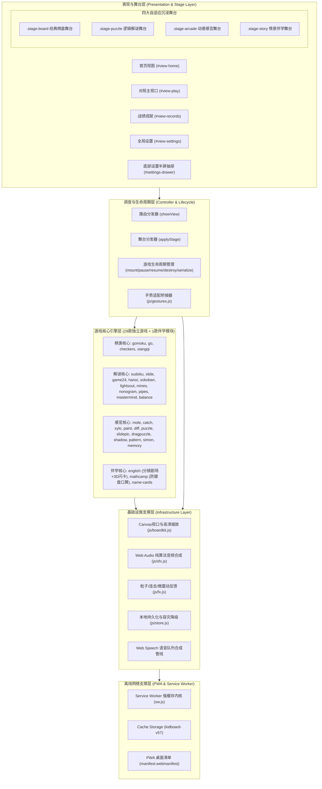
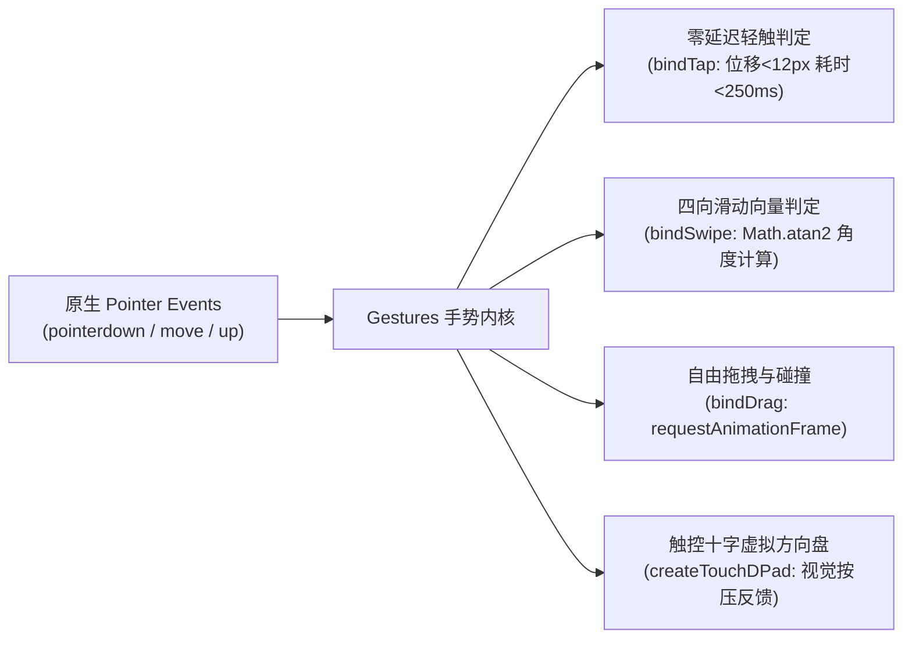
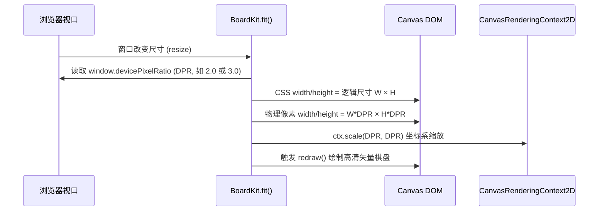
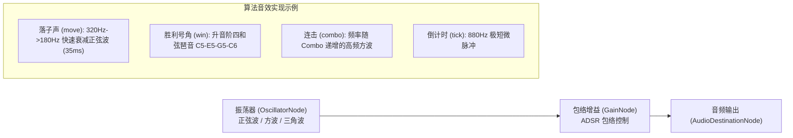
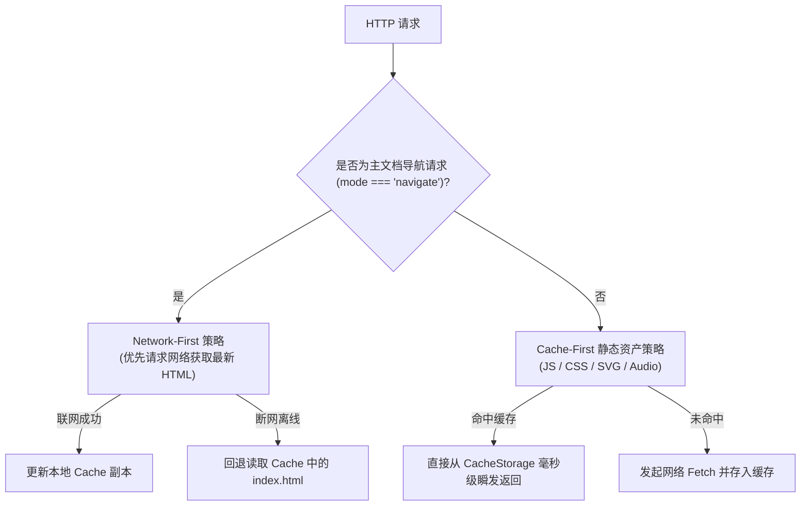

# 小小棋盘 · 儿童棋类与全脑益智乐园
## 技术架构设计说明书 (Technical Architecture Document)

---

## 1. 架构愿景与设计哲学

「小小棋盘」项目面向全平台（手机、平板、电脑）儿童益智与课标伴学场景，遵循以下五大底层工程设计哲学：

1. **零构建哲学 (Zero-Build & Zero-Tooling)**：
   不依赖 Webpack、Vite、Rollup 等任何打包构建工具，所有代码均为现代原生 ES6+ / Vanilla JS，可直接由浏览器解析执行，具备极高的长期可维护性与零依赖启动能力。
2. **零外部网络依赖 (Zero-CDN & 100% Self-Contained)**：
   杜绝引入外部 CDN 字体、图标或在线库。所有矢量图形均由内联 SVG 实时渲染，音效全部基于 Web Audio API 算法实时合成，断网环境下依然具备 100% 完整功能。
3. **原生极致性能 (60FPS Native Experience)**：
   以原生 DOM + Canvas 2D + CSS3 3D 硬件加速为渲染核心，无重度框架的虚拟 DOM 开销，在千元级低端平板与老旧手机上稳定维持 60 FPS 满帧运行。
4. **模块解耦与高度正交 (Stage-Driven Architecture)**：
   将应用外壳（路由、成就、设置、持久化）与 29 款游戏独立解耦；通过“四大自适应舞台（Stage Archetypes）”状态机动态注入样式与交互契约，根绝布局污染。
5. **儿童级人体工程学 (Child-Centric Ergonomics)**：
   全面重构交互热区、微震动反馈、防止系统双击缩放误触，以大按键（$\ge 48\text{px}$）与边缘铺满（Edge-to-Edge）保障儿童操作精准度。

---

## 2. 总体系统架构全景

系统分为 **表现与舞台层**、**调度与生命周期层**、**游戏核心引擎层**、**基础设施支撑层** 以及 **离线网络支撑层** 五大层次：



---

## 3. 核心子系统架构设计与实现

### 3.1 视图路由与舞台状态机 (`js/app.js`)

#### 1. 舞台映射字典 (`STAGE_MAP`)
系统建立静态映射表，决定游戏加载时激活何种舞台原型：
```javascript
var STAGE_MAP = {
  // 棋盘舞台
  gomoku: 'board', go: 'board', checkers: 'board', xiangqi: 'board',
  // 逻辑解谜舞台
  sudoku: 'puzzle', slide: 'puzzle', game24: 'puzzle', hanoi: 'puzzle',
  sokoban: 'puzzle', lightsout: 'puzzle', mines: 'puzzle', nonogram: 'puzzle',
  pipes: 'puzzle', mastermind: 'puzzle', balance: 'puzzle',
  // 动感感官舞台
  mole: 'arcade', catch: 'arcade', xylo: 'arcade', paint: 'arcade',
  diff: 'arcade', puzzle: 'arcade', slidepic: 'arcade', dragpuzzle: 'arcade',
  shadow: 'arcade', pattern: 'arcade', simon: 'arcade', memory: 'arcade',
  // 情景伴学舞台
  english: 'story', mathcamp: 'story'
};
```

#### 2. 舞台切换与控件清洗机制 (`applyStage`)
当玩家启动游戏时，`applyStage(stageType, g, id)` 负责动态重置 DOM 树样式：
- **`stage-board`**：挂载完整对弈侧边栏、先后手选择、悔棋/认输/提一手；
- **`stage-puzzle`**：强制隐藏 `btnResign`（认输）与先后手，按游戏元数据 `g.noUndo` / `g.noHint` 决定是否暴露撤销与提示，挂载专属键盘；
- **`stage-arcade`**：彻底隐藏侧边栏 (`.side-panel`)、对局状态与棋类底栏，直出满屏 Canvas；
- **`stage-story`**：彻底剥离内边距与最大宽度限制，开放 Edge-to-Edge 全屏画布。

#### 3. 游戏标准生命周期契约 (Game Lifecycle Protocol)
每个挂载到全局 `window.Games[id]` 的游戏模块均实现以下标准化接口：
```typescript
interface GameInstance {
  mount(host: HTMLElement, api: GameHostAPI): GameController;
}

interface GameController {
  serialize?(): object;             // 序列化当前盘面以供断点续玩
  pause?(): void;                   // 离开视图时暂停物理引擎与计时器
  resume?(): void;                  // 返回视图时恢复计时器
  redraw?(): void;                  // 屏幕尺寸或主题变化时重绘 Canvas
  destroy?(): void;                 // 卸载游戏时清理事件监听与定时器
}

interface GameHostAPI {
  status(msg: string): void;        // 向系统状态栏抛送文本
  win(detail?: string): void;       // 触发通关奖励结算（音效/加星/成就）
  lose(detail?: string): void;      // 触发战败结算
  draw(): void;                     // 触发和局结算
  save(): void;                     // 主动触发存档
}
```

---

### 3.2 自适应布局与 Fluid Typography 排版引擎 (`css/style.css`)

#### 1. Fluid Typography（自适应流体字阶）
为了确保同一套代码无缝运行于 320px 手机、768px iPad 及 2K 电脑，排版广泛采用 CSS `clamp()` 数学公式：
$$\text{font-size} = \text{clamp}(V_{\min}, V_{\text{pref}} \cdot \text{vw}, V_{\max})$$

- **生词主标题 (Grid 模式)**：`clamp(24px, 5.2vw, 32px)`；
- **生词特大号 (Hero 沉浸模式)**：`clamp(34px, 8vw, 48px)`；
- **Combo 连击徽章**：`clamp(28px, 6vw, 46px)`。

#### 2. 全宽零留白布局 (Edge-to-Edge Container Override)
在情景伴学舞台 (`.stage-story`) 中，通过多级样式穿透解除内边距约束：
```css
.stage-story .play-body {
  grid-template-columns: 1fr !important;
  gap: 0 !important;
}
.stage-story #stage-viewport,
.stage-story .stage-viewport {
  max-width: 100% !important;
  width: 100% !important;
  margin: 0 !important;
  padding: 0 !important;
  background: transparent !important;
  border: none !important;
  box-shadow: none !important;
}
.pep-wrap {
  width: 100% !important;
  max-width: 100% !important;
  margin: 0 !important;
}
```

---

### 3.3 轻量通用触控手势内核 (`js/gestures.js`)

采用原生 **Pointer Events** 标准封装，统一鼠标、电容触控笔与指尖手势，具备四项核心能力：



#### 1. 零延迟轻触判定算法
规避移动端 WebKit 传统的 300ms 点击延迟，同时精准过滤拖拽时的手抖抖动：
```javascript
function onPointerUp(e) {
  var dt = Date.now() - startTime;
  var dist = Math.hypot(e.clientX - startX, e.clientY - startY);
  if (!moved && dist <= threshold && dt < 450) {
    handler.call(el, e);
  }
}
```

#### 2. 虚拟十字方向盘 (Touch D-Pad)
在推箱子 (`sokoban`) 等游戏底部动态构建高对比度 D-Pad，支持长按连发与多方向轻触，保证单手持握手机时的操作舒适度。

---

### 3.4 Canvas 高清屏渲染与视口适配 (`js/boardkit.js`)

针对 Apple Retina 屏与 Android 高分辨率屏出现的 Canvas 模糊问题，`BoardKit` 提供自适应渲染管线：



---

### 3.5 纯代码 Web Audio 离线音频合成引擎 (`js/sfx.js`)

彻底抛弃外部 MP3 音频文件加载，全部使用 Web Audio API 原生振荡器（OscillatorNode）与增益节点（GainNode）基于数学物理模型实时合成：



**移动端静音解锁 (Audio Unlock)**：在移动端 Safari/Chrome 首次收到 `touchstart` 或 `click` 用户手势时，自动唤起 `ctx.resume()`，破除浏览器自动播放限制策略。

---

### 3.6 微动效与微震动反馈引擎 (`js/fx.js`)

#### 1. 彩带粒子物理系统 (Confetti Physics)
采用自维护的纯 Canvas 物理粒子模拟系统：
- 每个粒子具备独立空间坐标 $(x, y)$、速度向量 $(v_x, v_y)$、重力加速度 $g = 0.28$、空气水平阻力因子 $\mu = 0.98$、自转角度 $\theta$ 与角速度 $\omega$；
- 粒子超出屏幕可视区域或生命周期归零时自动释放回收，并在动画终止时自动清理 Canvas 节点，保证内存零泄漏。

#### 2. 硬件微震动触感 (Haptic Vibration)
调用 `navigator.vibrate(ms)` 接口提供触觉微反馈：
- 落子：`12ms`；
- 消除/连击：`25ms`；
- 通关欢呼：`[30ms, 40ms, 60ms]` 三段律动震动；
- 尊重无障碍偏好：若系统开启 `prefers-reduced-motion` 则自动降级静音关闭。

---

### 3.7 本地持久化与抗崩溃存储引擎 (`js/store.js`)

#### 1. 命名空间与键名结构
所有键名统一以 `kidboard.v1.` 为前缀，形成结构化存储域：
- `kidboard.v1.settings`：音效开关、主题模式、各游戏自定义难度；
- `kidboard.v1.stars`：累计收集的智慧之星数；
- `kidboard.v1.badges`：已解锁成就徽章列表及解锁时间戳；
- `kidboard.v1.records`：历史对局明细（上限滚动存储 100 局）；
- `kidboard.v1.save.{gameId}`：未完成对局盘面数据序列化字典。

#### 2. 存储容灾与内存降级回退
在 iOS Safari 无痕模式或设备磁盘空间告急触发 `QuotaExceededError` 时，存储引擎自动透明降级至内存字典（In-Memory Map），保障页面不会抛出未捕获异常导致崩溃。

---

### 3.8 PWA 架构与 Service Worker 强缓存升级 (`sw.js`)



**热更新机制**：当修改代码并递增 `CACHE = 'kidboard-v57'` 后，Service Worker 触发 `skipWaiting()` 与 `clients.claim()`，页面检测到 `controllerchange` 事件后自动提示并平滑重载生效。

---

## 4. 重点业务模块深层技术实现

### 4.1 人教版英语模块架构 (`js/games/english.js`)

#### 1. 多语意剧场分镜状态机 (Story Theater Engine)
英语情景会话由课文多幕剧场驱动：
```javascript
// 剧场分镜数据模型
les.acts = [
  { id: 0, title: '校门问候', desc: '清晨校门相遇，热情挥手打招呼。' },
  { id: 1, title: '礼貌握手', desc: '绿茵草坪微风下，握手结识新朋友。' },
  { id: 2, title: '教室新朋', desc: '教室黑板前，Sarah 与 John 自我介绍。' },
  { id: 3, title: '课桌分享', desc: '课桌特写文具盒，主动分享彩色铅笔。' }
];
```
- **插画动态注入管线**：`PepIllustrations.getSceneSvg(unitKey, actIndex)` 实时返回矢量 SVG 节点，并由 CSS `opacity` 实现 120ms 平滑推镜转场；
- **台词-画卷双向联动**：点击任意台词，剧场大图自动推至对应幕次；点击幕次药丸，台词列表自动平滑滚动对齐 (`scrollIntoView({ behavior: 'smooth' })`)。

#### 2. 3D 拟物翻转生词闪卡实现
- 利用 CSS 3D Transforms：
  ```css
  .pep-card-inner {
    transform-style: preserve-3d;
    transition: transform 0.45s cubic-bezier(0.16, 1, 0.3, 1);
  }
  .pep-card-3d.flipped .pep-card-inner {
    transform: rotateY(180deg);
  }
  .pep-card-face {
    backface-visibility: hidden;
    -webkit-backface-visibility: hidden;
  }
  ```
- 正面渲染认识发音与自然拼读积木，反面渲染 1秒形象巧记与 TPR 动作指引。

#### 3. 语音合成与节流队列控制
调用原生 `window.speechSynthesis`，针对低版本浏览器发音重叠或无响应缺陷，封装单例语音播放控制管道：
- 播放新语音前强制清理旧语音 (`speechSynthesis.cancel()`)；
- **跨平台自适应语速校准引擎 (`getCalibratedRate`)**：
  - 针对 iOS WebKit 的 Web Speech API 加速缺陷（`rate: 1.0` 相当于桌面端 1.5x~2.0x）进行动态压缩校准；
  - 针对 Android 系统 TTS 及桌面端儿童课标听感进行深度标定（目标稳定于约 90~105 WPM 小学人教版磁带语速）；
  - 提供三档智能语速：`🐢 慢速跟读` (桌面 0.50 / iOS 0.35 / 安卓 0.45)、`📖 课本伴学` (★默认推荐，桌面 0.62 / iOS 0.42 / 安卓 0.52)、`🐰 流利原速` (桌面 0.76 / iOS 0.52 / 安卓 0.65)；
  - 设置持久化保存在 `Store` 中，全站自动继承用户偏好；
- **跟读间歇时间科学扩充**：角色对话连读间隙从 400ms 扩充至 1100ms，生词连读间隙从 500ms 扩充至 1200ms，为儿童预留充分的思考与跟读发音时间；
- 播放期间高亮当前正在发音的句子或卡片，并阻止快速连点造成的请求风暴。

---

### 4.2 棋类博弈算法引擎 (Chess AI Engines)

#### 1. Alpha-Beta 剪枝与深度搜索
在五子棋 (`gomoku.js`) 与中国象棋 (`xiangqi.js`) 中实现极小化极大（Minimax）与 Alpha-Beta 剪枝：
$$\alpha = \max(\alpha, \text{val}), \quad \beta = \min(\beta, \text{val})$$
当 $\alpha \ge \beta$ 时触发剪枝截断，搜索分支效率提升数倍。

#### 2. 性能熔断机制
为了避免递归搜索在低端移动设备上引发主线程丢帧，AI 循环内设置超时检查：
```javascript
if (Date.now() - startTime > MAX_THINK_TIME) {
  break; // 强制熔断并返回当前层级已评估出的最优走法
}
```

---

## 5. 项目工程结构与文件规范

```
xi-game/
├── index.html                   # 主程序单页入口 (HTML5 语义化结构)
├── name-cards.html              # 独立模块: 认名字班级大卡片
├── manifest.webmanifest         # PWA 桌面安装清单与主题色配置
├── sw.js                        # Service Worker 离线强缓存引擎 (v59)
├── _headers                     # 静态服务器缓存控制与安全响应头
├── css/
│   └── style.css                # 全局样式库: 4大舞台样式、Fluid排版、3D动效
├── js/
│   ├── app.js                   # 应用外壳: 路由调度、舞台分发、抽屉控制器
│   ├── boardkit.js              # Canvas 视口缩放、Retina 抗模糊、主题调色
│   ├── fx.js                    # 物理粒子彩带、连击弹跳徽章、微震动反馈
│   ├── gestures.js              # 轻量触控手势内核: 零延迟Tap/Swipe/Drag/D-Pad
│   ├── sfx.js                   # Web Audio API 原生算法音频合成器
│   ├── store.js                 # 本地离线持久化与抗崩溃容灾存储器
│   ├── games/                   # 29 款游戏独立实现模块 (IIFE 隔离)
│   │   ├── balance.js           # 平衡天平
│   │   ├── catch.js             # 接星星
│   │   ├── checkers.js          # 西洋跳棋
│   │   ├── diff.js              # 找不同
│   │   ├── dragpuzzle.js        # 拖拖拼图
│   │   ├── english.js           # 人教版英语 (分镜剧场+3D闪卡+拼读小火车)
│   │   ├── game24.js            # 24点
│   │   ├── go.js                # 围棋 (数子法判定)
│   │   ├── gomoku.js            # 五子棋 (Alpha-Beta搜索)
│   │   ├── hanoi.js             # 魔法汉诺塔
│   │   ├── lightsout.js         # 奇妙点灯 (模2代数方程保证有解)
│   │   ├── mastermind.js        # 推理密码
│   │   ├── mathcamp.js          # 口算训练营 (自绘防弹键盘)
│   │   ├── memory.js            # 记忆翻牌
│   │   ├── mines.js             # 扫雷 (首击安全保证)
│   │   ├── mole.js              # 开心打地鼠
│   │   ├── nonogram.js          # 像素数织
│   │   ├── paint.js             # 魔法小画板
│   │   ├── pattern.js           # 规律排排看
│   │   ├── pipes.js             # 旋转水管
│   │   ├── puzzle.js            # 可爱拼图
│   │   ├── shadow.js            # 影子找朋友
│   │   ├── simon.js             # 记忆亮灯
│   │   ├── slide.js             # 数字华容道
│   │   ├── slidepic.js          # 移动拼图
│   │   ├── sokoban.js           # 推箱子 (触控D-Pad方向盘)
│   │   ├── sudoku.js            # 经典数独 (唯一解生成器)
│   │   ├── xiangqi.js           # 中国象棋 (子力价值矩阵)
│   │   └── xylo.js              # 小木琴
└── docs/
    ├── PRD.md                   # 产品需求与功能规格说明书
    └── ARCHITECTURE.md          # 本技术架构设计说明书
```

---

## 6. 代码质量与安全防护策略

1. **命名空间与闭包隔离**：
   全站所有 JS 文件均以标准 `(function (global) { 'use strict'; ... })(this);` 立即执行函数包裹，仅向宿主显式暴露受控全局命名空间（如 `global.Games`、`global.Store`），杜绝全局变量污染。
2. **XSS 注入防御**：
   DOM 操作中凡涉及动态文本注入处，统一通过 `esc(s)` 函数进行 HTML 实体转义：
   ```javascript
   function esc(s) {
     return String(s).replace(/[&<>"]/g, function (c) {
       return { '&': '&amp;', '<': '&lt;', '>': '&gt;', '"': '&quot;' }[c];
     });
   }
   ```
3. **语法静态验证**：
   所有 JS 代码均经过严格语法校验（执行 `node -c **/*.js` 输出 0 警告与 0 错误）。
