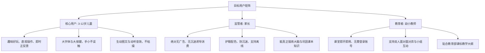
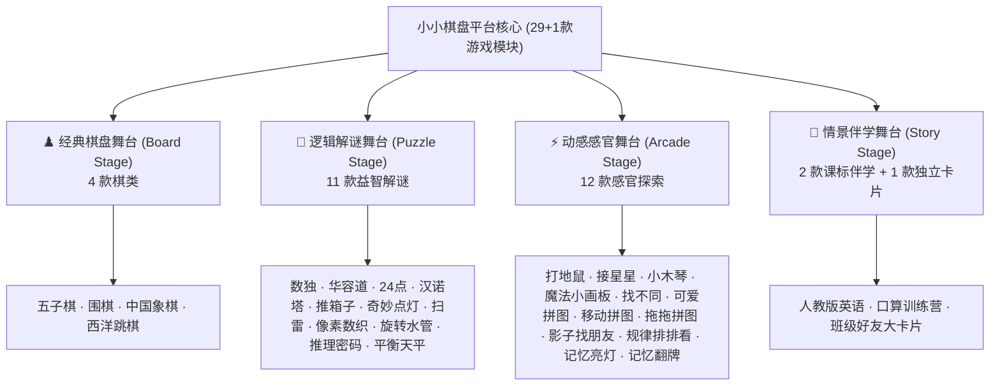
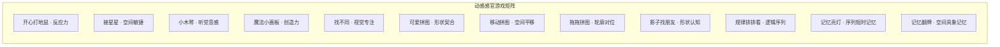
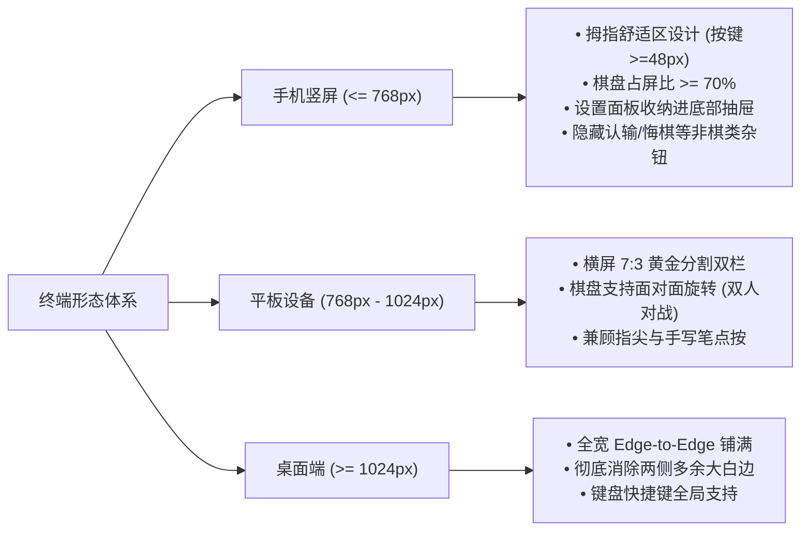

# 小小棋盘 · 儿童棋类与全脑益智乐园
## 产品需求与功能规格说明书 (Product Requirements Document - PRD)

---

## 1. 文档基本信息

| 属性 | 内容 |
| :--- | :--- |
| **产品名称** | 小小棋盘 · 儿童棋类与全脑益智乐园 (KidBoard) |
| **产品版本** | v2.5.0 (全项目沉浸式舞台架构与多端深度适配版) |
| **文档类型** | 产品需求与功能规格说明书 (PRD) |
| **目标受众** | 3 ~ 12 岁学龄前及小学低中年级儿童、家长、幼教及少儿辅导教师 |
| **技术形态** | 纯前端 PWA (Progressive Web App)，零后端，100% 离线独立运行 |
| **文档状态** | 正式生效版 (与线上代码完全同步) |

---

## 2. 产品定位与核心愿景

### 2.1 产品定位
「小小棋盘」是一个专为 3~12 岁少年儿童精心打造的**无广告、无内购、零诱导、纯净绿色的全脑思维成长与课标同步伴学平台**。

项目聚合了经典棋类对弈、逻辑推理、数学思维、感官探索及课标同步英语等多样化模块，采用原生网页技术实现，可安装至平板与手机主屏幕，断网环境依然流畅可用。

### 2.2 核心愿景
1. **纯净守护**：零广告弹出、零隐私搜集、零商业诱导，为孩子提供极致纯粹、安全的探索环境。
2. **思维赋能**：从直观感官认知到深度策略推演，系统性培育空间想象力、演绎推理力、数感与抗挫折心智。
3. **多端极致人体工学**：深度适配低龄儿童手部生理特征，彻底告别误触，打造平板与手机上的沉浸操作体验。
4. **科学伴学**：融合 TPR 身体反应教学法、自然拼读体系与艾宾浩斯抗遗忘记忆曲线，实现寓教于乐。

---

## 3. 目标用户画像与核心诉求

---

## 4. 总体功能架构与四大沉浸舞台 (Stage Archetypes)

为了彻底解决传统游戏聚合平台“千篇一律套用对弈侧边栏”导致的布局混乱与非必要按键（如拼图界面出现“认输”、“悔棋”等）问题，产品深度重构为**四大自适应沉浸舞台架构**：

### 4.1 四大舞台设计规范表

| 舞台类型 | 覆盖游戏数 | 移动端（手机）规范 | 平板与桌面端规范 | 核心控件体系 |
| :--- | :--- | :--- | :--- | :--- |
| **经典棋盘舞台 (Board)** | 4 款 | 主棋盘铺满屏幕 $\ge 70\%$；保留【悔棋/认输/提一手】；辅助设置一键收纳进底部抽屉 | 7:3 黄金分割双栏布局；支持旋转面对面对弈 | ↩️ 悔棋、💡 提示、🔄 重开、🏳️ 认输、PVE/PVP 切换 |
| **逻辑解谜舞台 (Puzzle)** | 11 款 | 彻底抹除“认输/对手/先后手”；配置专用触屏按键垫（Keypad/D-Pad）；按键尺寸 $\ge 48\text{px}$ | 居中最大化舞台；步数、计时与最优解对比；自适应视口居中 | ↩️ 撤销、💡 教学提示、🔄 重置关卡、自定义档位 |
| **动感感官舞台 (Arcade)** | 12 款 | 全屏沉浸无边框无侧栏；Canvas 60FPS 满帧运行；浮动 Combo 连击与触觉微震动 | 极简画卷居中；防误触拖拽与轻触响应 | 实时得分、连击徽章、倒计时进度条、重开/换图 |
| **情景伴学舞台 (Story)** | 2+1 款 | 全宽边缘铺满（Edge-to-Edge）；彻底去除 960px 宽度禁锢与白边；超大文字展现 | 宽屏情景剧场大画卷；多语意分镜实时联动；自绘防键盘弹出保护 | 课文情景分镜、3D 翻转闪卡、音素拆读、艾宾浩斯温故 |

---

## 5. 游戏模块详细功能规格说明

### 5.1 经典棋盘舞台 (Classic Board Stage) · 4 款

#### 1. 五子棋 (`gomoku`)
- **核心玩法**：15×15 棋盘，黑先白后，先连成横、竖、斜任意五子者获胜。
- **思维维度**：空间线索扫描、防守预判、攻防转换策略。
- **难度梯度**：
  - 简单：1 层贪心评估 + 随机干扰，适合 4~6 岁启蒙。
  - 一般：2 层 Alpha-Beta 极小化极大搜索，具备活三、死四封堵意识。
  - 困难：5 层 Alpha-Beta 搜索 + 增量评估窗口，策略严密。
- **特色功能**：落子涟漪波纹特效、最后一步高亮指示环、电脑思考状态气泡。

#### 2. 围棋 (`go`)
- **核心玩法**：9×9 迷你儿童棋盘，黑先白后，白贴 6.5 目。支持气尽提子、打劫禁着点与自杀禁手判定。
- **思维维度**：全局大局观、局部死活计算、围地与弃子权衡。
- **难度梯度**：简单（随机守形）、一般（启发式死活打分）、困难（候选落子点蒙特卡洛模拟对局）。
- **特色功能**：双方连续“停一手”判定终局；采用中国数子法（子 + 围空）自动计算胜负并高亮地域归属。

#### 3. 中国象棋 (`xiangqi`)
- **核心玩法**：10×9 经典楚河汉界棋盘，红先黑后。完整支持蹩马腿、塞象眼、炮翻山、兵过河横走、将帅不可照面等正规棋规。
- **思维维度**：多兵种子力协同、深层战术组合、逆境防守。
- **移动端适配**：严格匹配 9:10 盘面比例，底部配备“被吃子展示坞”，直观感受子力差。
- **难度梯度**：简单（单层评估）、一般（3 层迭代加深）、困难（5 层迭代加深 + 棋子位置价值矩阵）。

#### 4. 西洋跳棋 (`checkers`)
- **核心玩法**：10×10 经典方格跳棋，双方各 10 枚棋子。可单步前进或连续跳跃跨吃；棋子到底线自动加冕为“王棋（King）”。
- **独创防赖皮规则**：目标区格子若被己方腾空后遭对方赖着不走，系统自动判定己方占满，彻底根治死锁困局。
- **移动端适配**：可走路线与多段连跳路径动态脉冲光环引导，升王触发皇冠下落弹跳音效。

---

### 5.2 逻辑解谜舞台 (Puzzle Stage) · 11 款

#### 5. 经典数独 (`sudoku`)
- **玩法规则**：在方格中填入数字，使每行、每列及每个独立宫内数字均不重复。生成器保证**全局唯一解**。
- **盘面档位**：
  - 4×4 盘面（2×2 宫）：挖 5~10 空，幼儿入门，认识行与列。
  - 6×6 盘面（2×3 宫）：挖 12~21 空，建立宫格立体排除意识。
  - 9×9 盘面（3×3 宫）：挖 31~45 空，向高阶推理进阶。
- **专属交互**：
  - 底部大尺寸 1~9 数字触控九宫格键盘；
  - ✏️ 笔记草稿模式（候选小字标记，填入正解自动擦除同行同列冲突笔记）；
  - 💡 分步数独学堂（图解展示唯一余数法、隐藏唯一法原理）；
  - 冲突数字红色呼吸闪烁。

#### 6. 数字华容道 (`slide`)
- **玩法规则**：通过唯一的空格平移方块，将打乱的数字依序还原为 1 至 N。
- **算法保证**：从完成态进行随机有效步逆向打乱，数学上保证 **100% 有解**。
- **盘面档位**：3×3 (8字)、4×4 (15字)、5×5 (24字)。
- **交互设计**：支持点击与滑动双操作；方块平滑 CSS 3D 物理位移；顶部常驻步数与计时器；成功通关触发整体方块波浪欢呼动效。

#### 7. 24 点 (`game24`)
- **玩法规则**：抽取 4 张扑克牌（1~13），利用加、减、乘、除与括号运算算出结果等于 24。
- **算法保证**：内置有理数回溯求解器，剔除无解废牌，**题题必有解**。
- **交互设计**：两两点击融合计算法与算式编辑法兼备；大号扑克牌视觉呈现；卡壳时点击【💡 解法提示】分步展示解题思路。

#### 8. 魔法汉诺塔 (`hanoi`)
- **玩法规则**：三根立柱，将所有盘子从 A 柱挪至 C 柱；大盘永远不可压在小盘上方。
- **层数档位**：3 ~ 7 层阶梯挑战。
- **交互设计**：支持“点击源柱再点目标柱”与“拖拽移盘”双操作；顶部实时显示当前步数与理论最优步数 ($2^n - 1$) 对比；包含最优路径智能推演教学。

#### 9. 推箱子 (`sokoban`)
- **玩法规则**：操控工人在迷宫中推动箱子到指定目标点，箱子只能推不能拉。
- **移动端适配**：底部常驻超大尺寸**十字虚拟方向盘 (Touch D-Pad)**，同时支持全屏滑动手势；
- **视觉反馈**：箱子精准入库时变为金色发光宝石并发出清脆提示音；支持无限步数撤销。

#### 10. 奇妙点灯 (`lightsout`)
- **玩法规则**：点击任意方格，该格及其上下左右相邻格子的亮灭状态同时翻转；目标是将全盘所有灯全部熄灭。
- **算法保证**：基于线性代数模2方程组逆向打乱，确保每一局游戏均具可解性。
- **档位**：3×3、4×4、5×5。霓虹水波纹扩散动效，通关全屏星空闪烁。

#### 11. 扫雷 · 少儿护眼版 (`mines`)
- **玩法规则**：根据格子揭开后的数字提示避开隐藏地雷，翻开所有安全区域。**首击必定安全且展开大片空地**。
- **移动端适配**：底部设立大号核心模式切换药丸【⛏️ 探索挖地 / 🚩 标记插旗】；支持长按快速插旗；锁定双指缩放防误触。

#### 12. 像素数织 (`nonogram`)
- **玩法规则**：依据网格上方与左侧的连续数字序列，推理涂黑格子，还原神秘像素艺术图画。
- **档位与题材**：5×5（小动物）、8×8（蔬果交通工具）、10×10（综合像素画）。
- **交互优化**：底部【⬛ 填色 / ❌ 叉号标记】切换；支持按住连拖涂色；已满足条件的提示数字自动划线变淡；提供错格智能检查。

#### 13. 旋转水管 (`pipes`)
- **玩法规则**：点击管道方块使其旋转 90°，将水龙头起点与水池终点无缝贯通。
- **动效反馈**：全线贯通时播放淡蓝色水流波纹流动动效与通关欢呼音。

#### 14. 推理密码 (`mastermind`)
- **玩法规则**：破译由系统生成的 4 格不重复颜色密码组合，共有 8 次猜测尝试机会。
- **提示机制**：🟣 紫色钉表示颜色与位置完全正确；⚪ 白色钉表示颜色正确但位置错误。
- **专属操作**：底部常驻大号 6 色彩球调色盘；历史记录直观滚动呈现。

#### 15. 平衡天平 (`balance`)
- **玩法规则**：在天平左右托盘放置不同质量的数字砝码，通过不等式推理找出未知物体的重量或使其完全平衡。
- **思维维度**：数感启蒙、代数方程初探、守恒定律直观感知。

---

### 5.3 动感感官舞台 (Arcade Stage) · 12 款

#### 16. 开心打地鼠 (`mole`)
- **核心体验**：地鼠从 9 个洞口随机探头，轻触击打得分；包含金色闪光地鼠（奖励分）与炸弹地鼠（扣分扣时间）。
- **连击系统**：连续击中触发动态放大 Combo 徽章（`🔥 COMBO x3`）；60 秒倒计时机制。

#### 17. 接星星 (`catch`)
- **核心体验**：重力与手势结合，滑动屏幕底部果篮接住天空飘落的彩色星星；躲避乌云与闪电。
- **视听效果**：星星入篮产生清脆音阶上行音与星屑粒子喷泉。

#### 18. 小木琴 (`xylo`)
- **核心体验**：拟物八音木琴，严格采用十二平均律纯正自然大调标准音频合成（C4~C5）。
- **伴奏引导**：内置《小星星》《两只老虎》《欢乐颂》等儿童曲谱光效引导弹奏功能。

#### 19. 魔法小画板 (`paint`)
- **核心体验**：多色彩绘笔刷、霓虹荧光笔、几何贴图印章、撤销与一键清屏保存。
- **移动端保护**：防边缘划出屏幕，禁用系统手势阻断绘图。

#### 20. 找不同 (`diff`)
- **核心体验**：左右/上下两幅高清儿童矢量绘本插画，寻找 3 ~ 5 处细微差异细节；点击错误水波红圈，点击正确金星环绕。

#### 21. 可爱拼图 (`puzzle`)
- **核心体验**：4 / 9 / 16 块不规则传统拼图，支持参考底图半透明遮罩与磁吸边缘自动吸附。

#### 22. 移动拼图 (`slidepic`)
- **核心体验**：图形版华容道，将经典插画切为 3×3 九宫格，通过空位移动复原完整画面。

#### 23. 拖拖拼图 (`dragpuzzle`)
- **核心体验**：将右侧散落的具象动物/交通工具部件拖入左侧镂空轮廓中，适合 3~5 岁幼儿精细动作训练。

#### 24. 影子找朋友 (`shadow`)
- **核心体验**：左侧为高清彩色物品，右侧为全黑阴影剪影，通过触控连线或两点轻触进行配对，朗读中英文双语名称。

#### 25. 规律排排看 (`pattern`)
- **核心体验**：根据小火车车厢中物品的周期性规律（如 ABAB、AABB、ABCABC），推断下一节车厢应当填入的物品。

#### 26. 记忆亮灯 (`simon`)
- **核心体验**：经典西蒙四色游戏（红黄蓝绿），系统依次点亮带有音阶的按键序列，儿童依序复现。随着序列增长挑战记忆极限。

#### 27. 记忆翻牌 (`memory`)
- **核心体验**：6 / 8 / 12 对拟物 Emoji 卡牌翻面配对，真实 3D 翻转动效；翻对触发上浮微光与清脆叮当声。

---

### 5.4 情景伴学舞台 (Story Stage) · 2 款 + 1 独立模块

#### 28. 口算训练营 (`mathcamp`)
- **四大梯度阶段**：
  1. 启蒙阶段：10 以内加减法；
  2. 基础阶段：20 以内进退位加减法（破十法与凑十法）；
  3. 进阶阶段：表内乘法口诀与百以内加减；
  4. 挑战阶段：两位数混合运算与基础乘除。
- **独创防软键盘自绘保护**：页面自绘大按键虚拟数字键盘，**彻底阻止手机与平板唤起系统软键盘**导致视口剧烈抖动与截断。
- **智能错题本与进步曲线**：错题自动记录（同题去重），可一键启动“错题专项重练”；底部直观绘制近期正确率波形走势。

#### 29. 人教版英语伴学课堂 (`english`)
针对学龄儿童记忆词汇难、场景脱节的核心痛点，完成颠覆性重构：

##### (1) 多语意课文情景分镜剧场 (Let's Talk Multi-Scene Theater)
- **多幕矢量动态大画卷（语意变化，场景图即变）**：
  - **第 1 幕 · 校门问候**：清晨校门口朝阳高照，Mike 与吴斌斌挥手热情打招呼；
  - **第 2 幕 · 礼貌握手**：绿茵草坪上，新同学友好握手微笑问候；
  - **第 3 幕 · 教室新朋**：宽敞明亮教室讲台前，Sarah 与 John 自我介绍相识；
  - **第 4 幕 · 课桌分享**：课桌特写文具盒与彩色铅笔，Sarah 主动分享文具，传递友谊互助理念。
- **卡拉OK视听联动跟读**：朗读句子时文字逐词高亮变色，人物头像气泡产生呼吸跳动。

##### (2) 3D 拟物翻转生词闪卡流 (Let's Learn 3D Flashcards)
- **无死角全宽布局**：解除旧版 960px 宽度限制与内边距，实现无论手机还是平板两侧均无空白的 Edge-to-Edge 视觉流。
- **超大字号设计**：英文主词放大至 `clamp(24px, 5.2vw, 32px)`，粗度 900 特粗，对比极其强烈。
- **正面（认知发音）**：高清矢量插画（高度 110px） + 单词大字 + 国际音标 + 自然拼读音素积木（如 `[a] [r] [m]`） + 大发音喇叭。
- **反面（3D 物理翻转 · 1秒巧记）**：
  - 💡 **1秒形象巧记 (Magic Tip)**：字母象形与情景口诀；
  - 🏃 **TPR 身体反应指令**：如 “Touch your arm!”，指导孩子动身体建立深层肌肉反射；
  - 🧩 **音素拆读机直达**：点击即进入音素滑读。
- **双重学习模式切换**：
  - **▦ 平铺网格模式**：横向铺满展示单元全部核心生词，一览全局；
  - **🃏 单卡沉浸学习模式**：单词字号跃升至 **`clamp(34px, 8vw, 48px)`**，插画视窗高达 170px，专属底部大按钮【◀ 上一个】/【下一个 ▶】与进度指示（“生词 1 / 6”），特别适合低龄儿童专注精读。

##### (3) 自然拼读小火车 (Phonics Train) & 音素拆读机 (Soundout Machine)
- 辅音碰头车头与元音韵尾车厢相撞拼读，强化拼读规则感知。

##### (4) 跨设备自适应语速与科学跟读节律 (Cross-Platform Speech Rate & Cadence)
- **平台智能校准引擎**：自动识别 iOS WebKit、Android 系统 TTS 与桌面端浏览器差异，动态修正 iOS WebKit 自带的倍速发音问题，确保全平台统一呈现约 90~105 WPM 的人教版小学英语磁带标准语速。
- **三档沉浸语速一键切换**：
  - `🐢 慢速跟读`：音素拆读极慢、辅音爆破极清晰，专为初学跟读设计；
  - `📖 课本伴学`（★默认推荐）：沉稳温和的教材录音伴读节奏；
  - `🐰 流利原速`：纯正母语日常会话原速。
- **科学跟读间歇时间**：角色对话连读间隙设定为 1100ms，生词连读设定为 1200ms，保障儿童有充分时间理解并跟读模仿。

##### (5) 艾宾浩斯抗遗忘记忆唤醒舱 (Ebbinghaus Wakeup Chamber)
- 依据遗忘曲线算法（第 1、2、4、7、15 天）计算复习权重，自动调取今日需温习词汇启动“听音辨图”、“拼读闯关”测试。

#### 30. 认名字 · 班级好友大卡片 (`name-cards.html`)
- 独立单页应用：大尺寸拟物翻转卡片，展示全班同学真实姓名汉字、注音与性格标签，支持男女声朗读与拼音磁吸对齐。

---

## 6. 多端自适应与人体工程学设计规范

### 6.1 触控手势与防误触体系
- **禁用系统默认双指缩放与双击放大**：在画布视口上设置 `touch-action: manipulation` 与手势监听，防止幼儿在快速点按时意外触发浏览器缩放。
- **滑动阈值过滤**：轻触（Tap）与拖拽（Drag）位移判定阈值严格设定为 12px，消除误判。
- **触觉微震动反馈 (Haptic)**：支持 `navigator.vibrate` 的移动设备在落子、连击、过关时提供 12~35ms 清脆触觉反馈。

---

## 7. 激励与成长机制

### 7.1 🌟 智慧之星成长系统
- 任意游戏达成胜利/通关：获得 **1 ~ 3 颗智慧之星**；
- 口算训练营达成 5 连对或满分：获得 **额外加星奖励**；
- 首页动态展示当前星星总数与阶段进度条（里程碑：5星、15星、40星、80星）。

### 7.2 🏅 16 枚专属成就徽章墙
全系统内建无须登录、保存在本机的成就勋章库：

| 勋章 ID | 勋章名称 | 图标 | 达成条件 |
| :--- | :--- | :---: | :--- |
| `first_win` | 初露锋芒 | 🐣 | 赢得任意 1 局游戏胜利 |
| `math_streak` | 连对超人 | 🔥 | 口算训练营达成 5 连对及以上 |
| `math_master` | 极速心算家 | ⚡ | 口算单轮 10 题 100% 正确率 |
| `hanoi_3` | 通天塔学徒 | 🗼 | 成功通关汉诺塔 3 层 |
| `hanoi_master`| 汉诺塔宗师 | 👑 | 成功通关汉诺塔 5 层或以上 |
| `lights_novice`| 点灯小行家 | 💡 | 成功通关奇妙点灯关卡 |
| `lights_master`| 璀璨星空 | ✨ | 累计通关奇妙点灯 5 关以上 |
| `memory_champ` | 最强大脑 | 🎴 | 记忆翻牌完成全配对 |
| `game24_pro` | 巧凑24点 | 🎯 | 成功算出一道 24 点题目 |
| `slide_solved` | 华容道破局 | 🧩 | 成功还原数字华容道 |
| `nonogram_clear`| 像素画家 | 🦊 | 完成一幅数织像素画 |
| `nonogram_pro` | 数织大师 | 🎨 | 攻克 10×10 高阶像素数织 |
| `mastermind_crack`| 神探破译 | 🕵️ | 成功破译 Mastermind 密码 |
| `mastermind_fast` | 极速神探 | 🔍 | 4 次尝试以内成功破译密码 |

---

## 8. 产品非功能性规范 (NFR)

1. **零外部网络依赖与 100% 离线能力**：
   - 彻底摒弃外部 CDN 字体、图标库及远程音频；
   - 通过 Service Worker 预缓存全部 HTML/CSS/JS/SVG/Audio 资产，离线断网秒开。
2. **性能与帧率保障**：
   - 全动画与 Canvas 渲染保持 60 FPS 满帧刷新；
   - 电脑思考算法（如象棋、围棋、五子棋 AI）设置强制思考耗时上限（$\le 1.2\text{s}$），严防 UI 线程假死。
3. **数据隐私与安全**：
   - 零用户账号注册要求；
   - 战绩、存档、设置完全保存在浏览器 `localStorage` 中；提供 JSON 一键导出与恢复功能。
4. **包容性与儿童护眼**：
   - 默认采用柔和低饱和暖色调护眼主题；
   - 遵循 WCAG 2.1 AA 级色彩对比度标准，并提供夜间护眼模式。
