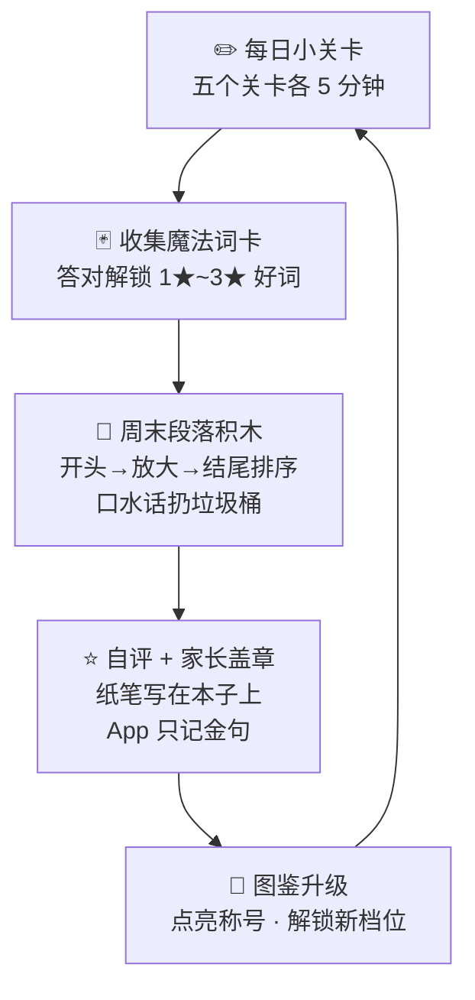

# 小小棋盘 · 句子魔法工坊（写作训练营）
## 产品设计与开发规格说明书

---

## 1. 文档基本信息

| 属性 | 内容 |
| :--- | :--- |
| **模块名称** | 句子魔法工坊 (`writing`)，归属「📖 情景伴学舞台 (Story)」 |
| **文档版本** | v0.5 设计草案（待评审；v0.2 增补 §4 方法论依据，v0.3 增补 §15 回合示例，v0.4 增补 §14 长期内容体系，v0.5 各关示例扩容至全部档位与变体 + §14.6 逐单元内容矩阵） |
| **关联文档** | [docs/PRD.md](PRD.md) · [docs/ARCHITECTURE.md](ARCHITECTURE.md) |
| **技术形态** | 纯前端，零后端，零外部依赖，100% 离线（与平台一致） |
| **首发目标用户** | 三年级学生（8~9 岁），首次为单一真实用户定制，题库可泛化 |

---

## 2. 背景与问题诊断

### 2.1 用户画像

三年级女生，处于「写话 → 习作」的课标过渡期（人教版三年级上册开始正式习作）。当前写作问题：

| # | 问题 | 表现 | 本质 |
| :--- | :--- | :--- | :--- |
| 1 | 错别字多 | 同音字混淆（在/再、作/做、以/已），形近字混淆 | 字词基础不牢 |
| 2 | 标点弱 | 一逗到底、句末无标点、问句用句号 | 缺「句子边界」意识 |
| 3 | 连词贫乏 | 句子之间生硬拼接，或「然后…然后…然后…」 | 缺句间逻辑意识 |
| 4 | 形容词贫乏 | 反复用「好看、开心、很」等基础词 | 词汇量小、无替换意识 |
| 5 | 流水账 | 每件事平均用力、按时间罗列、结尾「今天真开心」 | 缺「详略与放大」意识 |

### 2.2 训练策略：先句子，后成篇

三~四年级作文通顺的前提是**句子基本功**。本模块不做「写作文」，只做五件事：
**捉错字 · 断句子 · 接句子 · 升级词 · 挑重点**——每一件都做成一个可判定、有即时反馈的小游戏。
成篇写作（周末任务）只做「结构搭建 + 鼓励闭环」，纸笔创作留在作文本上（见 §8）。

### 2.3 问题 → 关卡映射

| 问题 | 关卡 | 一句话玩法 |
| :--- | :--- | :--- |
| 错别字 | 🐦 L1 错字啄木鸟 | 句子里藏着「虫子」，点一点啄出来 |
| 标点 | 🚦 L2 标点小交警 | 没标点的句子开进站，拖标点去指挥 |
| 连词 | 🔗 L3 连词对对碰 | 断成两半的句子，选对连词接上 |
| 形容词 | ⚗️ L4 词语炼金炉 | 把 1★ 的词炼成 2★、3★，炼出词卡收藏 |
| 流水账/口水话 | 🔍 L5 流水账手术台 | 给金句戴放大镜，把口水话划掉 |

---

## 3. 设计原则（硬性约束）

1. **客观可判**：所有训练都是「选 / 点 / 拖 / 排」型，机器 100% 可判定，才有即时反馈。自由写作**不进 App 判定**（无 AI、无 OCR），交给自评清单 + 家长盖章。
2. **不打字**：三年级孩子打字慢且挫败。全部交互用点选、拖拽、排序完成；例外只有家长代录「本周金句」（≤30 字）。
3. **答错不惩罚**：与启蒙乐园一致——答错摇一摇、亮答案、讲「为什么」，自动收进错本重练，不扣分不扣星。
4. **鼓励式反馈**：连对 3 题起 🔥 连击（复用 `Sfx.combo / Fx.combo`），通关彩带，每关有「进步曲线」让孩子看见自己在变强。
5. **自有素材优先**：题库中标记 `kid: true` 的题改造自她本人的日记/作文（错字原句、流水账原段）。「捉自己句子里的虫」最有针对性，也最有梗。
   依据：管建刚「先写后教、以写定教」「用自己的话写自己的事」——以学生原作为讲评教材，是「作后讲评重于作前指导」的家庭化实现（出处详见 §4）。

---

## 4. 内容来源与依据（方法论出处）

本模块的玩法、提示语与激励机制不是凭空设计，均需能在下表出处中追溯。三个层次：**课标定边界、经典方法定玩法、一线实践定激励**。

| 出处 | 定位与口碑 | 对本模块的贡献 |
| :--- | :--- | :--- |
| 《义务教育语文课程标准（2022 年版）》（教育部制定） | 国家课程标准 | ① 第一学段「根据表达的需要，学习使用逗号、句号、问号、感叹号」→ L2 标点范围上限；② 第二学段「尝试在习作中运用自己平时积累的语言材料，特别是有新鲜感的词句」→ L4 词卡价值与「有新鲜感」评判口径（统编三上第一单元语文要素即「关注有新鲜感的词语和句子」）；③ 第二学段「学习修改习作中有明显错误的词句」→ L1 捉虫与 L5 手术的合法性 |
| 王鼎钧《作文六要》（商务印书馆 2021；莫言、王安忆、曹文轩、窦桂梅、朱永新等联袂推荐；另著「作文四书」《作文七巧》《作文十九问》《文学种子》《讲理》） | 文学大师讲给青少年的写作课，方法体系经典 | 「六要」＝**观察、想象、体验、选择、组合、表现**，作为五关 + 周任务的顶层框架（映射见下表）；观察章「多看一眼，细看一眼」与专节「你有五种感官」（视、听、嗅、味、触）→ L5「五感放大镜」四角度的出处；「文章是『自己的』好」→ 原则 5 自有素材的立论 |
| 管建刚作文教学系列：《我的作文教学革命》《魔法作文营》《我的作文评改举隅》等（一线特级教师，出版专著 28 本） | 全国知名的一线习作教学实践体系 | ①「先写后教、以写定教」「作后讲评重于作前指导」→ 全模块以练代讲、用她的原作当讲评教材；② 流水账对策「写一件事要把事件像放电影似的显形于大脑，演绎不过来的地方用生活经验想象性地修复」→ L5 手术台判定与提示语；③《班级作文周报》发表激励机制（刊用纪念卡、稿费、等级评奖）→ 词卡图鉴、「我写的 ✍️」金句、盖章日历；④「妙语赏析」→ 周任务金句入图鉴 |
| 《日有所诵》薛瑞萍、徐冬梅、邱凤莲主编（亲近母语研究院，广西师范大学出版社，2007 年出版、长销 15+ 年；新闻出版总署向青少年推荐的百种优秀图书） | 儿童诵读教材领跑品牌 | 「日不间断地记诵……积累的是语言，培养的是诗性」→「每天 5 分钟」频率设计的原型；每卷 16 单元对应学期 16 周次 → 周任务按周推进的节奏；童谣童诗可作为 L4 语料与词卡例句的辅助来源 |

### 4.1 「六要」与模块玩法映射

| 王鼎钧「六要」 | 本模块承载点 |
| :--- | :--- |
| 观察（五感） | L5 放大镜的「看到的 / 听到的 / 闻到的 / 心里想」提示卡；L4 景物场面词卡 |
| 选择 | L4 炼金炉（选最准的词）；L5 删口水话（删繁就简） |
| 组合 | L3 连词对对碰（句子层面的组合）；段落积木（段落层面的组合） |
| 表现 | 周任务纸笔写作 + 金句入图鉴 |
| 想象 / 体验 | 二期可扩展：比喻想象句卡；素材始终来自她本人的生活（日记、班级事） |

### 4.2 使用规则（编写题库与文案时遵守）

1. 题目范围以课标为上限，不超纲（如冒号、引号三年级不入题）。
2. 每个关卡的提示语、攻略、错误反馈文案应能追溯到上表出处或统编教材课文/词语表；追溯不到的标注「通用练习」。
3. 不编造「某某书上说」；引用须转译成儿童语言，不照搬原文。

---

## 5. 总体玩法架构

### 5.1 养成循环



### 5.2 关卡总览

| 关卡 | 形式 | 档位 | 每轮题数 | 判胜 | 分期 |
| :--- | :--- | :--- | :--- | :--- | :--- |
| 🐦 L1 错字啄木鸟 | 点选句中错字（含「没虫」干扰句） | 萌新同音 / 进阶形近 / 挑战混合 | 8 | ≥80% | **一期 MVP** |
| ⚗️ L4 词语炼金炉 | 三选一升级句子中的基础词 | 萌新 ABB 词 / 进阶两字词 / 挑战成语 | 8 | ≥80% | **一期 MVP** |
| 🚦 L2 标点小交警 | 拖标点进句中空位 | 萌新句末标点 / 进阶逗号切分 / 挑战顿号混合 | 6 | 全对即胜 | 二期 |
| 🔗 L3 连词对对碰 | 前后半句点选配对 + 选词填空 | 萌新配对 / 进阶填空 / 挑战「然后改造」 | 6 | 全对即胜 | 二期 |
| 🔍 L5 流水账手术台 | 戴放大镜 + 划口水话 | 萌新只挑金句 / 进阶加删话 / 挑战合并成句 | 3 段 | 达标即胜 | 三期 |
| 🧱 段落积木（周任务） | 句块排序 + 垃圾桶 | 每周 1 题，按本周主题出 | 1 | 结构正确 | 二期 |

> 一期选 L1 + L4 做 MVP：最容易客观化、素材最容易从她的作文本里提取、见效最快。

---

## 6. 关卡详细规格

### 6.1 🐦 L1 错字啄木鸟

> 依据：课标第二学段「学习修改习作中有明显错误的词句」；错字范围参考统编教材各册写字表与她本人的错句。

- **玩法**：展示一句只有文字、没有提示的话。句中有 0~1 只「虫子」（错别字）。孩子**点句中的字**：点对，啄木鸟飞来把虫叼走，弹出正确写法 + 口诀提示；点错，句子摇一摇，提示「再看看」；句子没虫时，孩子点「这只没虫 ✔」按钮——**练「不乱啄」和「会检查」同样重要**。
- **判定**：`bug` 字精确匹配；`kid` 原句优先出。
- **难度梯度**：
  - 萌新：同音字（完/玩、在/再、作/做、以/已、座/坐、园/圆、进/近、蓝/篮），无干扰句。
  - 进阶：形近字（晴/睛、拔/拨、扔/仍、辫/辩、情/请/清），掺 20% 无虫句。
  - 挑战：混合 + 无虫句占 30%，并要求「说出为什么」（点对后补一句口诀）。
- **错字本**：点错/漏点过的字自动收进 `writing.wrong`（同字去重，上限 60），「错字重练」从错本出题，答对 2 次才移除（比口算的 1 次更严——错字需要重复巩固）。

**示例题（题库节选）**

| 句子 | 虫 | 正确 | 口诀提示 |
| :--- | :--- | :--- | :--- |
| 放学后，我先写作业，在去打球。 | 在 | 再 | 「再一次」用「再」，「正在这里」用「在」 |
| 我座在窗边看书。 | 座 | 坐 | 座位用「座」，坐下用「坐」 |
| 我们以经到站了。 | 以 | 已 | 「已经」是「已」，「以后」才是「以」 |
| 我最喜欢的运动是蓝球。 | 蓝 | 篮 | 篮球投进「篮」筐 |
| 她有一双明亮的眼睛。 | — | — | 没虫！别乱啄 🐦 |
| 今天我很开新。 | 新 | 心 | 「开心」是心情，不是新旧 |
| 星期天，我们去公圆看画展。 | 圆 | 园 | 场所用「园」（公园、校园、果园），圆圆的用「圆」 |
| 春天到了，我们一起去地里拨萝卜。 | 拨 | 拔 | 用力拔用「拔」（拔河、拔萝卜），轻轻拨用「拨」（拨电话、拨琴弦） |
| 天黑了，他扔在客厅写作业。 | 扔 | 仍 | 还在继续用「仍」（仍然），扔东西才用「扔」（扔垃圾） |

**变体实题示例（§14.3 轮换出场——同一个字换着花样练）**

| 变体 | 实题示例 |
| :--- | :--- |
| ① 点虫捉错 | 即上表全部 |
| ② 二选一填空 | 「我和小伙伴去公园（完 / 玩）。」→ 玩 |
| ③ 句子体检 | 三句连判：「教室里干干净净。」健康 ✔ ／「他跑得满头大汉。」有虫（汉→汗）／「今天阳光明媚。」健康 ✔ |
| ④ 听音辨字（TTS 可选） | 听「yǐjīng」选「已 / 以」→ 已；听「zuòwèi」选「座 / 坐」→ 座 |

### 6.2 ⚗️ L4 词语炼金炉

> 依据：课标第二学段「尝试在习作中运用自己平时积累的语言材料，特别是**有新鲜感的词句**」；统编三上第一单元语文要素即「关注有新鲜感的词语和句子」。「生动 ≠ 华丽」的语境陷阱对应「用得准」，防止把积累变成堆砌。

- **玩法**：展示一个句子，其中基础词（1★）被高亮。给出 3 个「炼金选项」，选出**最生动且意思相符**的那个。选对：炼金炉喷星星，该词卡飞进图鉴；选错：亮出每张卡的星级与意思。
- **词卡体系**（图鉴按主题分组：心情 / 动作 / 外貌神态 / 天气季节 / 景物场面）：

  | 星级 | 定义 | 示例 |
  | :--- | :--- | :--- |
  | 1★ | 基础词（可被替换） | 好看、开心、走、说、大、天气好 |
  | 2★ | 进阶替换词 | 美丽、愉快、漫步、喊道、巨大、阳光明媚 |
  | 3★ | 生动词 / 成语 / ABB 词 | 光彩夺目、心花怒放、蹑手蹑脚、金灿灿、亮晶晶、争先恐后 |

  > ABB 式形容词（金灿灿、绿油油、静悄悄）是三年级课本重点，萌新档主打。
- **判定**：`best` 为唯一正确答案，干扰项 = 同义但平淡（1★ 同级）、或生动但意思不符（防「哪个长选哪个」）。
- **图鉴**：每张卡带儿童语言释义 + 一个例句；解锁的卡在「词卡图鉴」页可翻阅（复用英语闪卡 3D 翻转交互）。

**示例题（题库节选）**

| 原句（高亮词） | 选项 | 正确 |
| :--- | :--- | :--- |
| 花园里有很多【好看】的花。 | A. 美丽 2★ / B. **五彩缤纷 3★** / C. 好看极了 1★ | B（A 没错但只是同义，C 是口水话） |
| 我【开心】得跳了起来。 | A. 高兴 / B. **一蹦三尺高** / C. 愉快 | B |
| 太阳【很大很热】。 | A. 烈日炎炎 / B. 火烧火燎 / C. **骄阳似火** | C（B 多指焦灼心情，意思不符） |
| 弟弟【走】进房间，怕吵醒妈妈。 | A. 跑 / B. 迈步 / C. **蹑手蹑脚地** | C（看语境！） |
| 运动会得了第一名，全班同学都【高兴】。 | A. 开心 / B. **欢呼雀跃** / C. 特别高兴 | B（A 只是同义，C 是口水话；B 写出了又跳又叫的场面） |
| 比赛输了，他【难过】地回家了。 | A. 伤心 / B. **垂头丧气** / C. 特别难过 | B（写出了耷拉着脑袋的样子） |
| 下过雨，水泥路【很湿】。 | A. **湿漉漉** / B. 全湿了 / C. 特别湿 | A（ABB 词，小水珠亮晶晶的画面感出来了） |

> 挑战档考察「生动 ≠ 华丽堆砌」：给一个 3★ 但不符合语境的选项，让孩子学会看句子意思选词。

**变体实题示例（§14.3 轮换出场）**

| 变体 | 实题示例 |
| :--- | :--- |
| ① 三选一升级 | 即上表全部 |
| ② 词卡配对 | 连「升级链」：开心 → 高兴 → 心花怒放；好看 → 美丽 → 五彩缤纷 |
| ③ ABB 补尾 | 「太阳照在湖面上，金灿__的。」三选一补尾（灿灿 / 闪闪 / 红红）→ 灿灿 |
| ④ 语境贴卡 | 即上表「弟弟【走】进房间」题——「生动但不符语境」的干扰项是它的招牌 |

> 上表仅为节选。正式题库按 **§14.6 逐单元矩阵** 补齐：每单元 L4 出 10 题、新词卡 15 张；五组主题（心情 / 动作 / 外貌神态 / 天气季节 / 景物场面）每单元至少各出 1 张，避免总练一种句式、总出一种场景。

### 6.3 🚦 L2 标点小交警（二期）

> 依据：课标第一学段「根据表达的需要，学习使用逗号、句号、问号、感叹号」；顿号仅在挑战档作并列衔接尝试，冒号、引号不入题。

- **玩法**：句子开进「修车站」，句子被切成若干段，段与段之间的空位是「停车位」。底部是一排标点小汽车（，。？！、）。孩子把标点**拖进空位**，空位数 = 需要标点数（消除「哪里都放」的歧义）。全部放对 → 小火车鸣笛出站；放错 → 该车位标点弹回并闪红灯。
- **难度梯度**：萌新 = 只考句末标点（。？！三选一）；进阶 = 逗号切分长句；挑战 = 并列词间顿号 + 问叹混合。

**三档实题示例**

| 档位 | 实题示例 |
| :--- | :--- |
| 萌新 · 句末三选一 | 「你吃过菠萝蜜吗」→ ？；「今天是我的生日」→ 。；「我终于学会骑自行车了」→ ！ |
| 进阶 · 逗号切分 | `[今天下午] [我和爸爸去书店] [买了几本故事书]` → `，，。` |
| 挑战 · 顿号混合 | `[今天下午] [我和妈妈去超市] [买了苹果] [香蕉] [和酸奶]` → 空 4 位，答案 `， ， 、 。` |

### 6.4 🔗 L3 连词对对碰（二期）

- **玩法 A 配对**：左列 4 个前半句，右列打乱的后半句。点左边再点右边，接对了两个半句「咔哒」合体发光。
- **玩法 B 选词填空**：句中空格三选一（因为…所以 / 虽然…但是 / 一边…一边 / 先…再 / 有的…有的 / 越…越）。
- **玩法 C 「然后改造师」**（挑战，专治口水话）：一段「然后…然后…然后…」的话，选出哪个「然后」该换成「接着 / 最后 / 过了一会儿」，哪个该直接删掉。

**三种玩法实题示例**

| 玩法 | 实题示例 |
| :--- | :--- |
| A 配对 | 天黑了，→ 我们点亮了灯。／因为下雨，→ 运动会取消了。／虽然累了，→ 他还坚持练完。／先洗手，→ 再吃饭。 |
| B 选词填空 | 「小明（ ）唱歌，（ ）跳舞。」→ 一边 / 一边（配对组另备：因为/所以、虽然/但是、先/再、越/越） |
| C 然后改造师 | 见下方示例 |

**示例 C**：`今天我去公园玩。然后我们坐了车。然后看到了花。然后我们吃了东西。然后回家了。` → ① 第二个「然后」→「接着」；② 最后一个 →「天黑了，我们才」；③ 其余两个删掉。

### 6.5 🔍 L5 流水账手术台（三期）

> 依据：五感四角度出自王鼎钧《作文六要》观察章专节「你有五种感官」（多看一眼，细看一眼）；「放大一个瞬间」对应管建刚流水账对策「把事件像放电影似的显形于大脑，演绎不过来的地方用生活经验想象性地修复」。

- **玩法**：一段 4~6 句的流水账（像她自己写的）。三步手术：
  1. **戴放大镜**：哪句最值得细写？（拖放大镜给金句，正确后提示可从「看到的颜色 / 听到的 / 闻到的 / 心里想的」四个角度放大）
  2. **划口水话**：把「真的很开心」「然后我们就回家了」这类句子拖进垃圾桶。
  3. **合并**（挑战）：把两句废话合并成一句。
- **判定**：金句 `zoom` 唯一；口水话集合 `trash` 逐一判定。
- **示例段落**：`今天我去公园玩。然后我们坐了车。然后看到了花。花很漂亮。然后我们吃了东西。然后回家了。今天真开心。` → 放大镜给「看到了花」（可放大：颜色、香味、蜜蜂），垃圾桶收「花很漂亮」「今天真开心」「然后我们坐了车」。
- **示例段落 2**：`今天我过生日。然后吃蛋糕。然后看电视。动画片真好看。然后睡觉了。今天真开心。` → 放大镜给「吃蛋糕」（可放大：奶油的甜味、蜡烛的火光、大家唱的生日歌）；垃圾桶收「动画片真好看」「然后睡觉了」「今天真开心」。

### 6.6 🧱 段落积木（周任务，二期）

- **玩法**：每周一个主题（如「课间十分钟」「一场雨」）。给出 5~6 个打乱的句块（含 1~2 个口水话干扰块），孩子把句块拖成 **开头一句（时间人物地点）→ 放大一段（一个瞬间写细）→ 结尾一句（心情或想法）** 的正确结构，口水话块扔进垃圾桶。
- **判定**：顺序为 `head → zoom(1~2) → tail`，干扰块全进垃圾桶。
- 与 L5 的区别：L5 练「读与挑」，段落积木练「结构与排」，是纸笔写作前的最后一步脚手架。

---

## 7. 词卡图鉴与激励体系

- **词卡图鉴**：收集页按主题分 5 组，卡片 3D 翻转展示（复用英语闪卡组件风格）。卡片来源三种：关卡解锁、家长代录「本周金句」自动成卡（来源标「我写的 ✍️」，最珍贵）、连续达标奖励。
- **徽章**（新增 6 枚，接入现有 31 枚体系）：

  | 徽章 | 条件 |
  | :--- | :--- |
  | 🐦 啄木鸟医生 | L1 任一档位判胜 3 次 |
  | 🔍 捉虫神眼 | 错字本清空 1 次 |
  | ⚗️ 炼金术士 | 收集 10 张词卡 |
  | 📖 图鉴大师 | 收集 40 张词卡 |
  | 🚦 断句小交警 | L2 任一档判胜（二期） |
  | ✍️ 周末小作家 | 连续 4 周获得家长盖章（二期） |
- **称号**：沿用平台「智慧之星」进度条，把写作关卡积分并入总积分。
- **防沉迷克制**：无连续登录奖励、无体力值、无排名——平台一贯的零诱导原则。

---

## 8. 周任务与反馈闭环（写作落点）

> 依据：管建刚《班级作文周报》发表激励体系——「刊用纪念卡、稿费、等级评奖」让发表成为写作动力，学生的「发表意识、读者意识、真话意识、作品意识」由此激发。本模块以「金句入图鉴 + 盖章日历」做家庭版微缩实现；自评清单对应其「作后讲评」中「妙语赏析」的自我化。

写作的最终输出仍在**纸笔作文本**上（保护书写能力，也绕开打字/OCR 限制），App 负责脚手架与激励：

1. 周日领任务：本周主题 + 系统从图鉴里挑 3 张「本周词卡」（孩子已解锁的）。
2. 平时关卡攒词卡与「放大镜思路」（L5 的四角度提示就是写作提示）。
3. 周末纸笔写 3~5 句 → 孩子对照**星级自评清单**打星 → 家长盖章（App 里点一下，记录日期）：

   > □ 用上了 3 张本周词卡　□ 标点都在　□ 有一句「放大」的句子　□ 没有「然后…然后…」　□ 写了看到的/听到的/闻到的至少一种

4. 家长在 App 里**代录一句本周金句**（≤30 字）→ 自动入图鉴「我写的 ✍️」。
- **数据**：`writing.stamps` 记录每周盖章与金句，形成「小作家日历」；连续盖章点亮徽章。
- **家长负担控制**：整个闭环家长只需 30 秒（看一眼 + 点章 + 录一句）。这是设计红线，超出的家长操作一律不做。

---

## 9. 题库规范

### 9.1 数据文件与结构

题库与代码分离：`js/writing-data.js`（挂 `window.WRITING_DATA`），家长补充题只改数据文件。

```js
window.WRITING_DATA = {
  /* L1 错字：kid=true 表示改造自孩子本人作文 */
  typos: [
    { id: 't001', text: '我座在窗边看书。', bug: '座', fix: '坐',
      hint: '座位用「座」，坐下用「坐」', kid: false, kp: '座坐' }
  ],
  /* L4 炼金 */
  gold: [
    { id: 'g001', sentence: '花园里有很多好看的花。', target: '好看', kp: '好看',
      options: [
        { w: '美丽', s: 2, ok: false, why: '意思对，但只是换个说法，不够生动' },
        { w: '五彩缤纷', s: 3, ok: true,  why: '写出了颜色多，画面感一下出来了' },
        { w: '好看极了', s: 1, ok: false, why: '还是原来的意思，属于口水话' }
      ] }
  ],
  /* L2 标点：segs 切段，marks 为段间标点（空位数 = marks.length） */
  puncts: [
    { id: 'p001', segs: ['你去过北京吗'], marks: ['？'] }
  ],
  /* L3 连词 */
  conjs: [
    { id: 'c001', left: '因为下雨了', right: '我们取消了野餐',
      conj: '所以', distractors: ['但是', '虽然'] }
  ],
  /* L5 流水账 */
  flowbooks: [
    { id: 'f001', sentences: [
        { t: '今天我去公园玩。', tag: 'keep' },
        { t: '然后看到了花。', tag: 'zoom' },
        { t: '花很漂亮。', tag: 'trash' }
      ], angles: ['颜色', '香味', '声音', '心里想'] }
  ],
  /* 段落积木 */
  paragraphs: [
    { id: 'pa001', topic: '课间十分钟', blocks: [
        { t: '下课铃一响，我们就冲出了教室。', kind: 'head' },
        { t: '小明在跳绳，绳子甩得呼呼响。', kind: 'zoom' },
        { t: '真的很开心。', kind: 'trash' },
        { t: '上课铃响了，我恋恋不舍地回到座位。', kind: 'tail' }
      ] }
  ]
};
```

### 9.2 容量与来源规划

| 分期 | 题量 | 来源 |
| :--- | :--- | :--- |
| 一期（三上同步包） | 错字 64（每单元 8） + 炼金 80（每单元 10，词卡 120 张按 8 单元分组解锁）——逐单元配额见 §14.6 | 统编三上各单元《词语表》 + 语文园地 + 她的日记错句 |
| 二期 | 标点 30 + 连词 30 + 段落积木 12 | 她的作文原句改写 + 课标例句 |
| 三期 | 流水账 15 段 | 她的完整流水账作文（脱敏） |
| 持续 | 家长每周 5 分钟（录入当单元词语 / 补 5~10 题 `kid: true`） | 本周作文本 + 课本进度 |

辅助语料：统编教材各单元《词语表》与语文园地（L4 词卡主来源）、《日有所诵》童谣童诗（词卡例句参考），均标注「依据」来源；书上查不到的词卡一律不收。

> 静态题库约 2~3 周即玩穿。长期供给机制（四层管道、知识点调度、变体轮换、供给/消耗对账）统一见 **§14 长期内容体系**，为一期数据结构的硬性前提。

### 9.3 出题规则

- 出题由**知识点调度器**决定（§14.2）：未见过 > 低掌握度 > 间隔到期复习；`kid: true` 优先权重 ×2。
- 干扰项必须「错得有理由」（见 L4 `why` 字段），禁止纯凑数选项。
- 所有示例句长度 ≤ 20 字（挑战档 ≤ 30 字），生僻词不出。
- **多样性硬规则**：一轮 8 题须覆盖 ≥4 个不同知识点、≥3 种生活场景（学校 / 家里 / 户外）；同一题面一学期内不得重复出现——复习一律换变体题面（见 §14.2 知识点旅程）。

---

## 10. 数据与存储

沿用 `Store`（`localStorage` 前缀 `kidboard.v1.`），新增键：

| 键 | 内容 | 上限 |
| :--- | :--- | :--- |
| `writing.wrong` | 错字本 `{ word, fix, ts, okStreak }`，答对连续 2 次移除 | 60 |
| `writing.cards` | 已解锁词卡 `{ word, star, from: 'level'\|'mine'\|'bonus', ts }` | 不限 |
| `writing.hist` | 各关卡最近 20 轮 `{ level, tier, rate, ts }`（进步曲线） | 20/关 |
| `writing.stamps` | 周任务 `{ week, stampedAt, sentence }` | 52 |
| `writing.progress` | 各关档位星级与解锁状态 | — |

浏览器禁用存储时随平台自动降级内存模式。

---

## 11. 技术集成方案

| 项 | 方案 |
| :--- | :--- |
| 新增文件 | `js/games/writing.js`（单文件 IIFE，模式参照 `mathcamp.js`：内部子 Tab 切换五关）+ `js/writing-data.js` |
| 注册 | `app.js` 的 `GAMES` 数组追加 `'writing'`；`STAGE` 映射 `writing: 'story'`；`index.html` 卡片 + `<script>` 引入 |
| 舞台规范 | Story 舞台：全宽 Edge-to-Edge、正文最小 18px、句字号 ≥22px；触控热区 ≥48px |
| 交互 | 全部 Pointer Events 自绘（参照 `nonogram` 拖涂、英语闪卡翻转）；拖拽用 `gestures.js`；**全程不唤起系统键盘** |
| 复用 | `Store`（存储）、`Sfx`（对错音、`combo`）、`Fx`（连击、彩带、弹跳）、玩法说明（`rules/guide` 元数据）、徽章与战绩页 |
| 动画 | 炼金喷星、啄木鸟叼虫、小火车出站均为 CSS transform/opacity 级别；遵守 `prefers-reduced-motion` 自动关闭 |
| 离线 | `sw.js` 的 `CACHE` 版本 +1，静态资源 `?v=` 同步升级 |
| 部署 | `bash deploy.sh` 随平台发布 |

---

## 12. 分期路线图与验收标准

### 一期 MVP（L1 + L4 + 图鉴 + 错字本）
- [ ] `writing.js` 五关框架 + 档位选择器（L2/L3/L5 显示「敬请期待」，不隐藏结构）
- [ ] 一期内容包 = 三上同步包（按 §14.6 逐单元矩阵交付）：L1 64 题 + L4 80 题 + 词卡 120 张，每单元 8 + 10 + 15——首月零补题不断供
- [ ] 知识点调度器基础版（§14.2）+ 变体框架（L1/L4 各先实现 2 种变体）
- [ ] 错字本收录 + 重练（答对 2 次移除）；两关进步曲线
- [ ] 连击 / 彩带 / 音效 / 徽章 4 枚接入
- [ ] 玩法说明（首次弹窗 + ❓ 随时查看）与攻略文案
- [ ] 验收：双击 `index.html` 离线可玩；iPhone SE 宽度（375px）无横向滚动；答错不扣分不弹键盘；SW 版本递增且更新后旧局进度保留

### 二期（L2 + L3 + 段落积木 + 周任务盖章）
- [ ] 标点拖放（Pointer 拖拽 + 磁吸吸附）、连词配对/填空、「然后改造师」
- [ ] 段落积木每题按周主题出；盖章日历 + 金句代录（家长 30 秒闭环）
- [ ] 徽章 +2；验收同上（拖拽在触屏实机测试无粘连、无拖影）

### 三期（L5 + 持续运营）
- [ ] 流水账手术台三步玩法 + 「四角度放大」提示卡
- [ ] 「家长加题」极简入口：粘贴句子 → 标虫字 → 存入题库（可选，若复杂则维持改 `writing-data.js`）
- [ ] 作家日历总览页（周任务历史 + 图鉴完成度 + 进步曲线汇总）
- [ ] 题库余量仪表与家长补题提醒（§14.5）

---

## 13. 风险与开放问题

| # | 风险/问题 | 对策 |
| :--- | :--- | :--- |
| 1 | 内容重复或短缺（静态题库 2~3 周玩穿） | §14 四层管道持续供给 + §14.6 逐单元矩阵锁定配额 + 知识点调度（非题目随机）+ 变体轮换（每关 ≥3 种）；余量仪表预警（§14.5）+ 家长每周 5 分钟补题流程写进「攻略」页 |
| 2 | 干扰项出歧义（如 L4 两个词都通顺） | 规范 9.3：每个干扰项必须可解释；题库评审时逐题过 `why` 字段 |
| 3 | 孩子把「升级词」理解成「越华丽越好」 | 挑战档专设「语境不符」陷阱题；图鉴卡片释义强调「用得准」 |
| 4 | 周任务流于形式 | 盖章记录可视化成「小作家日历」；金句入图鉴给足荣誉感；家长操作压到 30 秒 |
| 5 | 金句代录的输入体验 | 家长用手机/平板自带输入法（家长场景允许系统键盘，与儿童交互隔离） |

---

## 14. 长期内容体系（防重复、不断供、可持续进阶）

> 设计红线：内容必须长期丰富，不重复、不短缺。核心思路——把「静态题库」升级为「内容供给管道」：**只要语文课在推进、她在写作文，题目就自动再生**。

### 14.1 四层内容管道

| 层 | 来源 | 产出节奏 | 说明 |
| :--- | :--- | :--- | :--- |
| 🍚 主粮 · 课本同步 | 统编课本单元进度：词语表、语文园地「日积月累」、单元语文要素、课文例句 | 每单元（约 2 周）≥30 题 + 15 个新知识点 | 家长模式按单元录入当册词语（每单元 5 分钟）；一期直接预置三上全册词语表，零操作。难度与课内对齐：学到第 N 单元才解锁 N 单元的题，永远「刚好比她学的新一点」 |
| ✍️ 素材 · 原作转化 | 她每周日记/作文 | 每周 3~5 题（捉虫句、流水账段、金句词卡） | `kid: true` 权重 ×2。管道而非库存——只要还在写作文就不断供，且永远最有梗 |
| 🛟 兜底 · 通用基础盘 | 预置题库，按知识点标签组织 | 一期 140 题 → 每学期扩 60~80 | 凑轮、专项重练、原作题不足时补位 |
| 🎭 变体 · 玩法轮换 | 同一知识点的多种题型 | 不新增内容，新增「新鲜感」 | 见 14.3 |

### 14.2 知识点调度（防重复的底层机制）

- **题面 ≠ 知识点**：每个同音组 / 形近组 / 词语 / 连词是一个知识点（`kp`）节点，题目只是知识点的「皮肤」（schema 见 §9.1 的 `kp` 字段）。
- 每个知识点带掌握度 0~3 星与上次出现时间。调度优先级：**未见过 > 低星 > 高星且间隔到期**（间隔 3 → 7 → 14 → 30 天螺旋拉长）。
- 毕业 = 3 星且该知识点的每种变体都答对过。毕业知识点不再占用轮次。
- 高星知识点的复习**换变体出**：「完/玩」第一次点虫捉出、第二次二选一填空、第三次句子体检——孩子的体验是「升级打新玩法」，不是「又做过了」。间隔复习是记忆规律（SRS），重复感靠变体消除。
**知识点旅程示例——同一个「在 / 再」的四次见面（防重复是这样实现的）**

| 见面 | 时间 | 变体 | 题面 | 掌握度 |
| :--- | :--- | :--- | :--- | :--- |
| 第 1 次 | 第 1 周 | ① 点虫捉错 | 「放学后，我先写作业，在去打球。」 | 1★ |
| 第 2 次 | 3 天后 | ② 二选一填空 | 「我（在 / 再）家写作业。」 | 2★ |
| 第 3 次 | 10 天后 | ③ 句子体检 | 混在 2 句健康句、1 句「满头大汉」里判断 | 3★ |
| 第 4 次 | 40 天后 | 挑战轮兜底复现 | 作为干扰字藏在无虫句里 | 毕业，移出轮次池 |

> 期间任一次答错：掌握度回退 1 星、该字进错字本（§6.1），间隔重置回 3 天。孩子看到的四道题「长得都不一样」，背后是同一个知识点的螺旋巩固——「重复的是知识点，不重复的是题面与玩法」。

- **一期即实现调度器基础版**——数据结构决定后期能不能长，这是硬性前提。

### 14.3 题型变体库（每关 ≥3 种，轮换出场）

| 关卡 | 变体 |
| :--- | :--- |
| 🐦 L1 错字啄木鸟 | ① 点虫捉错 ② 二选一填空（完/玩）③ 句子体检（给整句标「健康/有虫」，练整体检查）④ 听音辨字（TTS 可选） |
| ⚗️ L4 词语炼金炉 | ① 三选一升级 ② 词卡配对（1★↔2★↔3★ 连线）③ ABB 补尾（亮晶__）④ 语境贴卡（看句选最贴的词） |
| 🚦 L2 标点小交警 | ① 句末三选一 ② 拖标点断句 ③ 「一逗到底」改错 |
| 🔗 L3 连词对对碰 | ① 前后句配对 ② 选词填空 ③ 然后改造师 |
| 🔍 L5 流水账手术台 | ① 挑金句 ② 挑金句 + 删口水话 ③ 再合并成句（三档即三变体） |

轮换规则：同一变体不连续超过 2 轮；每周至少见到 2 种变体。

### 14.4 学期进阶地图（长期目标感）

- 每册语文书 = 一张进阶地图；每个单元 = 地图上 8 格小关卡（由 14.1 主粮层产出），通关点亮。
- 学段阶梯：三上 8 单元 → 三下 8 单元 → 四上……内容随课本无限延伸。
- 称号阶梯：三上「魔法学徒」→ 三下「炼金能手」→ 四上「句子大师」→ 四下「小小作家」，接入平台智慧之星总积分。
- 词卡图鉴按册/单元**分册装订**（像集邮册，一册一单元）：一期 120 张 → 全年 200+ 张。
- 周任务主题直接映射统编习作单元，学期 16 周不断供。三上 8 次习作主题：猜猜他是谁 / 写日记 / 我们眼中的缤纷世界 / 我来编童话 / 续写故事 / 这儿真美 / 我有一个想法 / 那次玩得真高兴；另 8 周自由主题从她当周生活事件选。三下开学后按课本补录。

### 14.5 供给 / 消耗对账（防短缺仪表）

| 管道 | 年供给（题面） | 年供给（新知识点） |
| :--- | :--- | :--- |
| 课本同步（16 单元/年） | ~480 | ~240 |
| 原作转化（40 周） | ~160 | 独占不重复 |
| 基础盘扩容 | ~120 | ~60 |
| **合计** | **~760** | **~300** |

- 消耗按**人次**计：8 题 × 5 天 × 40 周 = 1600 人次/年；对应 ~400 个知识点 × 螺旋 4 次（3/7/14/30 天）≈ 1600 人次——恰好一年体量。复习人次复用题面变体，**不需要 1600 道不同的题**。
- 知识点随掌握度毕业逐年递减，越往后越轻松；新知识点周消耗 ~10 < 周供给 ~15，正向余量。
- **余量仪表**：图鉴页显示各关「未出题余量」，任一关 < 10 题时提示家长「本周补题 5 分钟」并给出流程指南（§9.2）；原作转化层永远有货。

### 14.6 三上逐单元内容矩阵（一期主粮的交付蓝图）

四层管道（14.1）不是抽象承诺，落到三上就是下表。**每单元固定配额：L1 出 8 题、L4 出 10 题、新词卡 15 张**——8 个单元合计 L1 64 题、L4 80 题、词卡 120 张，与 §9.2 一期容量对账一致；周任务主题即该单元习作（与 §14.4 衔接）。

| 周次 | 单元 · 人文主题 | 语文要素（→ 出题口径） | L1 主打知识点（示例） | L4 词卡主打（示例） | 周任务主题 |
| :--- | :--- | :--- | :--- | :--- | :--- |
| 1~2 | 一 · 学校生活 | 关注有新鲜感的词语和句子（L4 全年价值口径的总纲） | 完/玩、在/再、座/坐 | 鲜艳、打扮、朗读、湿漉漉 | 猜猜他是谁 |
| 3~4 | 二 · 金秋时节 | 运用多种方法理解难懂的词语 | 晴/睛、漂/飘 | 明朗、金黄、油亮亮、五彩缤纷 | 写日记 |
| 5~6 | 三 · 童话 | 感受童话丰富的想象 | 蜜/密 | 可怜、饥饿、蹑手蹑脚、争先恐后 | 我来编童话 |
| 7~8 | 四 · 预测 | 一边读一边预测，顺着情节猜想 | 到/倒 | 浓密、发愁 | 续写故事 |
| 9~10 | 五 · 观察（习作单元） | 留心观察周围事物 | 合/和 | 观察、合拢、翠绿、静悄悄 | 我们眼中的缤纷世界 |
| 11~12 | 六 · 祖国河山 | 借助关键语句理解一段话的意思 | 贵/桂 | 五光十色、瑰丽无比、嫩绿、名贵 | 这儿真美 |
| 13~14 | 七 · 我与自然 | 感受课文生动的语言，积累喜欢的语句 | 汇/会 | 美妙、温柔、滴滴答答、叮叮咚咚 | 我有一个想法 |
| 15~16 | 八 · 美好品质 | 学写一件简单的事，把事情写清楚 | 烈/列 | 犹豫、热烈、持久、诚实 | 那次玩得真高兴 |

> 上表知识点为示意（按统编三上课文与语文园地常见词整理），实施时以她课本的《词语表》《写字表》逐字校准——校准只需家长在「家长模式」里逐单元勾选，一次约 30 分钟，换册时重复同一流程。全面性不靠题海堆出来：**「单元 × 语文要素 × 她本人的错字」三个维度交叉出题**，同一单元不重复同一句式，同一知识点按 14.2 的旅程表换变体重逢。

---

## 15. 附录：一回合完整示例（周三晚 19:30，5 分钟）

**素材**：她当天日记原句「放学后，我和妈妈去公园**完**，看见一只花猫在睡觉。」——`kid: true`，权重 ×2 优先出题（管建刚「先写后教、以写定教」）。

**L1 萌新档 · 本轮 8 题，示例展示其中 3 题**

| # | 句子 | 交互 | 反馈文案 | 追溯 |
| :--- | :--- | :--- | :--- | :--- |
| 1 | 放学后，我和妈妈去公园完，看见一只花猫在睡觉。 | 点「完」 | 捉到啦！完→玩。口诀「在外面玩耍用『玩』（王+元）；做完事情才用『完』」 | 课标二学段「学习修改习作中有明显错误的词句」 |
| 2 | 今天天气晴朗，小鸟在树上叫。 | 点「这只没虫 ✔」 | 对！没有错字就别乱啄，检查也是一种本领 | 「修改」的前置技能 = 先会检查（课标修改要求） |
| 3 | 我把作业作完了。 | 点第二个「作」（「作业」的作是干扰项） | 捉到啦！作→做。口诀「动手做：做作业、做手工；写成文：作文、作品」 | 同上 + §4.2 规则 3（口诀转译，不照搬原文） |

**回合结算**：8 题对 7（≥80% 判胜，★☆），彩带，连击峰值 🔥×4；错字本收录「完→玩、作→做」（`okStreak: 0`，重练答对 2 次移除，见 §6.1）；判胜奖励词卡「亮晶晶 3★ · 景物场面」（统编课本词语，课标「有新鲜感的词句」口径）入图鉴；历史写入 `writing.hist`（进步曲线 +1）。答错全称仅「摇一摇 + 亮答案」，不扣分（§3 原则 3、4）。

**衔接周日**：本周已攒 3 张词卡 → 周任务《我的花猫》：开头一句（放学后 + 公园）→ 五感放大（花纹颜色 / 呼噜声 / 心里想——《作文六要》「你有五种感官」）→ 结尾一句（心情）；自评清单 5 项（§8）；家长盖章 30 秒。

> 本示例即一期 L1 的实现验收参照：题干呈现、判定、反馈文案、结算数据、错字本与词卡行为均以此为准。
